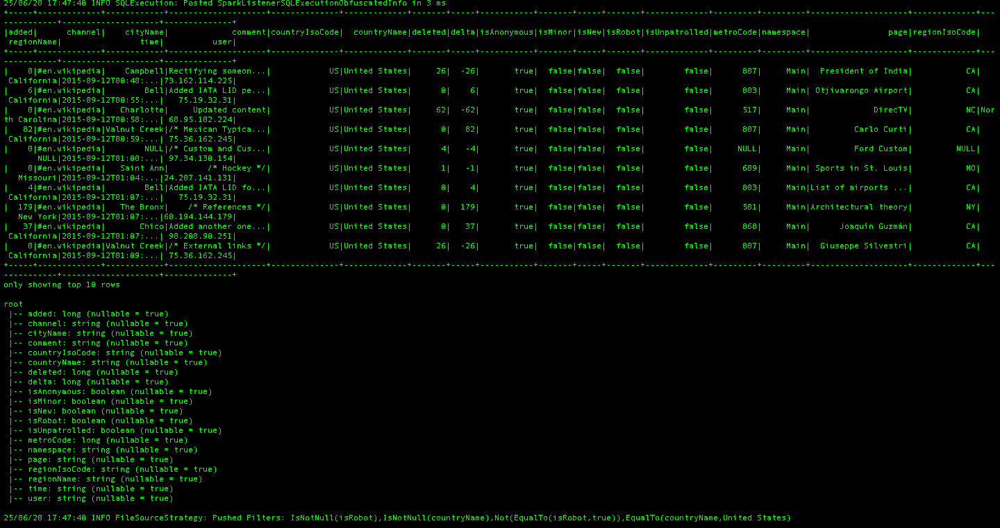

# Batch Processing of large data using PySpark on AWS EMR

## Description 
This project focuses on batch processing Wikipedia data to analyze large volumes of data and gain insights into its content and structure. Using AWS EMR (Elastic MapReduce) with PySpark, the process preprocess Wikipedia articles and employs techniques like text analysis, sentiment analysis, and statistical analysis. These methods help identify patterns and trends in the articles, ultimately aiding in training machine learning models.

## Background 
Data processing can be classified in to multiple types depending on the type and volume of the data & complexity and speed of the processing. Batch processing the technique of processing large volumes of data grouped together at periodic intervals of time allowing efficient processing of data in a consistent manner while reducing errors and risk of data loss or corruption by processing data in a controlled and consistent manner.It also  supports historical reporting that helps in tracking the trends and patterns in the data. 

The batch processing involves several key steps: collecting data from various sources and storing it temporarily, validating the data to meet required standards, transforming it into a suitable format, processing it with algorithms, and finally, storing the results in a designated location for further analysis or processing.So, batch processing technique is used to efficiently process the Wikipedia data used for analysis in this project which comes in regular data dumps that contain entire contents of the site. 

## Data
The wikipedia dataset used in this project is in JSON format and it contains wikipedia edits that were made on September 12,2015. 
The [dataset](Data/wikiticker-2015-09-12-sampled.json) includes information about each edit, such as the title of the editted article, the
username or IP address of the editor, the timestamp of the edit, and the text of the edit itself. 

## Goal 
The primary goal of this project is to use the AWS services such as S3 for data storage and EMR as the processing cluster to process the wikipedia data for two main tasks: to filter out records by  conditions, where `isRobot`: False & `countryName`: “United States” and to aggregrate the data by the channel.
This information can be used for various analyses and research purposes related to Wikipedia, such as studying patterns in the types of edits that are made, examining the behavior of different types of editors, or tracking the evolution of particular articles over time.

## Datapipeline 

### 1. Storage of sampled data in AWS S3 bucket 
AWS S3 bucket is created with two folders: `input-dat`a for storing raw sampled data and `output-data` for storing processed data. Then the raw wikipedia data should be uploaded to the inpu-data folder of the S3 bucket.

### 2. Set up AWS EMR cluster 

- *Amazon EMR*:

  Amazon EMR( Elastic Map Reduce) is used as the processing cluster in this project. Amazon EMR is a fully-managed big data processing service from AWS that simplifies handling large data volumes using frameworks like Apache Hadoop, Apache Spark, and Presto. It automates the provisioning, scaling, and management of clusters running these frameworks. EMR offers a user-friendly web interface, command-line tools, and APIs for cluster management. It's key features include being fully managed, scalablility with workload demands, being flexible with support for various big data tools, having a pay-as-you-go model and spot instances, and integrated with other AWS services like S3, DynamoDB, and Redshift for seamless data movement.

 - *Creating EC2 key pair*:
   
   In order to ecurely access the EC2 instances that will be created when creating the EMR cluser, a key pair should be created and downloaded as a .pem file. The key pair is used to authenticate the SSH (Secure Shell) connections to EC2 instances, and it's important to keep it secure and protected.

- *Configuring the cluster*:
  
  When creating the EMR cluster, the **Spark application** bundle is installed, including **Hadoop** and **Spark** for big data processing, **Hive** for data warehousing and SQL-based querying, and **Zeppelin** as a collaborative notebook for data analytics and visualization using SQL and Python. The network and security settings are configured to allow SSH access to the primary cluster node using an SSH key pair.IAM roles for the cluster should be granted permissions for S3FullAccess and EC2FullAccess policies, as AWS S3 will be used for storage and EC2 for computing and processing.

### 3. Connect to the EMR cluster using SSH via CLI

The following  steps are performed to make a connection to the running EMR cluster using the CLI or terminal app.
1. Navigate to the folder where the SSH key pair file is stored.
2. Retrieve the public DNS name of the master cluster node of the EMR cluster.
3. Connect to the master node of the EMr cluster using the SSH key by folllowing command:
   ```python
   ssh -i <keypair file name> hadoop@ < public DNS of master node>
   ```
4. Slect 'yes' for the prompt if connecting the cluster for the first time.

### 4. Running the Pyspark codes on the EMR cluster
In order to perform the filtering and aggregrating tasks for this project, two seperate python scripts are created using the python's Pyspark library designed for working with large datasets. These codes will fetch the data from the AWS S3 bucket's `input-data` folder, perform filtering and aggregration on the data and finally push the processed data back into appropriate folders in `output-data` folder of the S3 bucket.

The python codes are run in the ER cluster using the follwoing commands in the CLI : 
1. Use `vi` command to create and name the python file.
2. Enter the insert mode pressing the 'i' key.
3. Copy the python scripts to the CLI.
4. Escape and exit the insert mode.
5. `:wq` command to write the file to the disk and quit `vi` which saves and exit the file.
6. use `spark-submit-filename.py` to execute the created python file on the EMR cluster.

- #### I. Filtering script
  As shown in the [main () function of the filtering script](codes/main.py), the JSON data fetched from the S3 storage bucket is converted to a spark dataframe in order to apply the filtering the condition, **"isRobot"== False & "countryName == 'UnitedStates'**. The function prints the count of the records in the filtered dataset and the schema of the dataset, followed by storing the filtered dataset in the `"output-data/filtered"` folder of the s3 bucket overwritten in the paqruet format.
  
The following images shows the printschema of the filtered dataset obtained from the EMR cluster using CLI : 

           *Image 1: Printschema of the filtered dataframe* 
 
 The number of records in the filtered dataset is **528** as shown in the [CLI](Images/4.png)
   
- #### II. Aggregating script
The [main() function of the aggregated script](codes/aggregation.py) shows the JSON data fetched from the S3 storage bucket is converted to a spark dataframe in order to aggregate the data by the channel. The function prints the count of the records in the aggregated dataset and the schema of the new dataset, followed by storing the aggregated dataset in the `"output-data/aggregated"` folder of the s3 bucket overwritten in the paqruet format.
  
The following images shows the printschema of the filtered dataset obtained from the EMR cluster using CLI : 

                  *Image 2 : Printschema of the aggregated dataframe*
                  
 
 The number of records in the aggregated dataset is **51** as shown in the [CLI](Images/3.png)

### 5. Analyze the data using AWS Athena 


 
